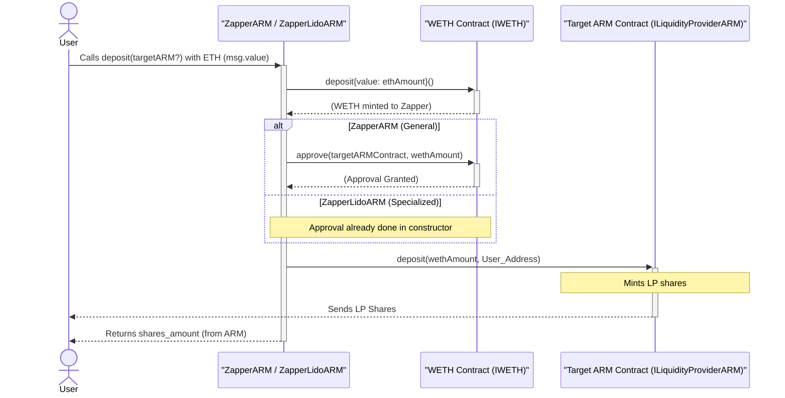

# User Flow: Liquidity Provision via Zap

This document describes the process by which a user provides liquidity to an Automated Redemption Module (ARM) using the blockchain's native currency (e.g., ETH on Ethereum mainnet). This is facilitated by a "Zapper" contract, which streamlines the multiple steps typically involved into a single transaction for the user.

## Overview

Zapper contracts enhance user experience by abstracting the complexities of:
1.  Wrapping native currency into its ERC20 equivalent (e.g., ETH to WETH).
2.  Approving the target ARM contract to spend the wrapped ERC20 token.
3.  Depositing the wrapped ERC20 token into the ARM.

The user simply sends native currency to the Zapper, and the Zapper handles these intermediate steps, ensuring the user receives LP shares from the target ARM directly.

## Actors

*   **User:** The individual wishing to provide liquidity.
*   **Zapper Contract:** A utility smart contract designed for this purpose. Examples include the generic `ZapperARM.sol` or the specialized `ZapperLidoARM.sol`.
*   **Wrapped Native Token Contract:** The ERC20 contract for the wrapped version of the native currency (e.g., WETH, conforming to `IWETH`).
*   **Target ARM Contract:** The specific ARM instance (conforming to `ILiquidityProviderARM`) where the user intends to deposit liquidity.

## Flow Steps

1.  **User Initiates Deposit with Native Currency:**
    *   The User identifies the ARM they wish to deposit into and the corresponding Zapper contract.
    *   The User sends a transaction to the Zapper contract, calling its `deposit` function and including the native currency (e.g., ETH) as `msg.value`.
        *   If using `ZapperARM.sol`, the user calls `deposit(address targetArmAddress)` and sends ETH.
        *   If using `ZapperLidoARM.sol` (where `LidoARM` is pre-configured), the user can call `deposit()` and send ETH, or simply send ETH directly to the `ZapperLidoARM` contract address, which triggers its `receive()` payable fallback that then calls `deposit()`.

2.  **Zapper Wraps Native Currency:**
    *   The Zapper contract receives the native currency.
    *   It interacts with the Wrapped Native Token contract (e.g., WETH contract, referenced as `ws` or `weth` in the Zapper).
    *   It calls the `deposit()` function on the Wrapped Native Token contract, converting the received native currency into its ERC20 wrapped form. These wrapped tokens are now held by the Zapper contract.
    *   `ZapperContract -> WrappedNativeToken.deposit{value: nativeAmount}()`

3.  **Zapper Approves Target ARM (Conditional):**
    *   **For `ZapperARM.sol`:** The Zapper contract needs to grant permission to the target ARM to withdraw the newly wrapped tokens. It calls `approve(targetArmAddress, wrappedAmount)` on the Wrapped Native Token contract.
        *   `ZapperContract -> WrappedNativeToken.approve(targetArmAddress, wrappedAmount)`
    *   **For `ZapperLidoARM.sol`:** This step is typically performed once during the `ZapperLidoARM`'s constructor (`weth.approve(lidoArm, type(uint256).max)`). Therefore, for subsequent zap transactions, an explicit approval per deposit is not needed, saving gas.

4.  **Zapper Deposits into Target ARM for User:**
    *   The Zapper contract calls the `deposit(uint256 assets, address receiver)` function on the Target ARM Contract.
        *   `assets`: The total amount of wrapped native currency obtained in Step 2.
        *   `receiver`: The address of the original `User` (the `msg.sender` of the transaction to the Zapper). This ensures the LP shares are minted to the user.
    *   `ZapperContract -> TargetARMContract.deposit(wrappedAmount, UserAddress)`

5.  **Target ARM Mints LP Shares:**
    *   The Target ARM Contract receives the deposit of the wrapped native currency.
    *   It calculates the number of LP shares to be minted based on its current state (e.g., total assets, total supply of LP shares).
    *   The Target ARM Contract mints these new LP shares directly to the `User`'s address.

## Outcome

*   The **User** successfully provides liquidity to the Target ARM Contract and receives LP shares representing their position in the pool.
*   The **Target ARM Contract**'s liquidity pool is increased by the amount of wrapped native currency deposited.
*   The **Zapper Contract** ideally holds no funds (related to this transaction) at the end of the process, having transferred all wrapped assets to the ARM.

## Mermaid Sequence Diagram

This flow simplifies liquidity provision for users, especially those starting with native currency, by automating the necessary intermediate steps within a single, user-friendly transaction.
